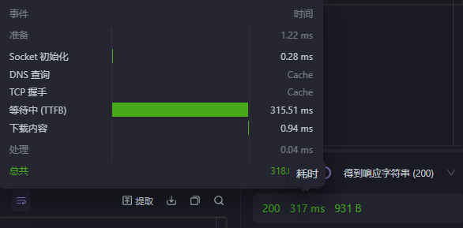
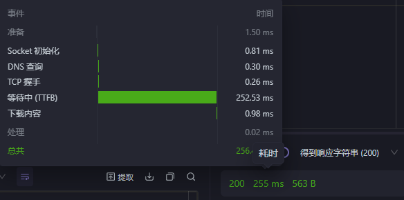

# 基于springboot的微信公众号模板

# TODO
- 完善各类消息的Handler
- 将任务触发的配置文件与主配置文件拆分
- 获取AccessToken 以及 使用AccessToken的各种功能(自定义菜单栏、群发消息、上传媒体文件)


# 项目结构
```
D:.
├─main
│  ├─java
│  │  └─org
│  │      └─wechat
│  │          ├─component
│  │          │  └─handler (各种消息处理器)
│  │          ├─controller (服务器请求的视图函数)
│  │          ├─mine
│  │          │  ├─task (自定义任务)
│  │          │  └─tool (自定义任务所需的工具)
│  │          └─service (服务器服务)
│  └─resources
│      └─META-INF
└─test
    └─java

```
# 自定义任务须知
- 自定义任务必须继承AbstractTask类 实现getDataList方法
- getDataList返回一个字符串数组
- 字符串数组第一个元素为响应消息的类型
- 字符串数组随后的元素为这个类型的消息的必要参数
- 完成自定义任务函数之后必须在配置文件中填函数触发的正则表达式及该任务函数的所在位置
```
text:
  order:
    - - "^([\\u4e00-\\u9fa5]{2,5}) ([\\u4e00-\\u9fa5]{2,5}) 天气$"
      - "org.wechat.mine.task.WeatherForecast"
    - - "你的任务触发消息"
      - "任务类的包路径"...
```

# 运行
运行该java文件 WechatServerApplication.java 或者 以该文件为主类打包项目
`java -jar WechatServer.jar`

# 为毛我发现响应时间还变慢了
两种框架做同样任务
- Springboot


- Flask



稳定在250ms左右 有时候会出现1s以上的情况

